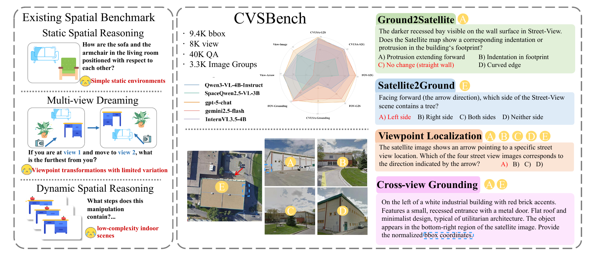
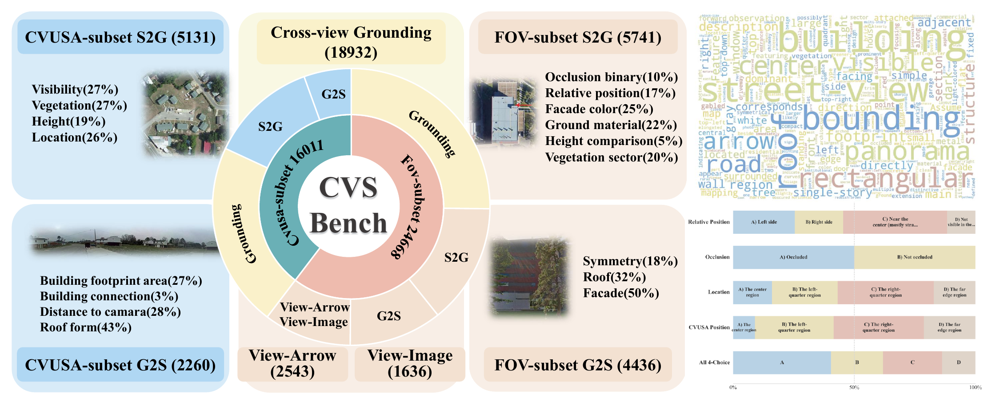

<div align="center">

# 🌍 CVSBench

### Cross-View Spatial Reasoning and Dreaming Benchmark

[](https://huggingface.co/datasets/zlyzlyzly/CVSBench)
[](#-license)
[]()

<h4>

<a href="PAPER_LINK">📄 Paper</a> |
<a href="https://zhanglingyu328.github.io/CVSBench/">🌐 Project Page</a> |
<a href="https://huggingface.co/datasets/zlyzlyzly/CVSBench">🤗 Dataset</a> |
<a href="https://github.com/Zhanglingyu328/CVSBench">💻 GitHub</a>

</h4>

</div>

---

<p align="center">
  
</p>

## 📖 Overview

CVSBench is a benchmark for evaluating multimodal foundation models on:

- 🧭 Cross-view spatial reasoning
- 🎯 Cross-view grounding
- 🛰️ Satellite ↔ Street-view understanding
- 🖼️ Visual imagination from partial observations

This repository contains the official evaluation toolkit for CVSBench experiments.

The project is organized across three entry points:

- GitHub: code, evaluation scripts, documentation
- Hugging Face: full dataset release
- Project Page: paper overview, visualizations, and examples

<p align="center">
  
</p>

## 🔗 Resources

- GitHub: [Zhanglingyu328/CVSBench](https://github.com/Zhanglingyu328/CVSBench)
- Dataset: [zlyzlyzly/CVSBench](https://huggingface.co/datasets/zlyzlyzly/CVSBench)
- Project Page: [zlyzlyzly/CVSBench](https://zhanglingyu328.github.io/CVSBench/)
- Paper: to be released

## 📦 Dataset Download

The full dataset is hosted on Hugging Face:

👉 [https://huggingface.co/datasets/zlyzlyzly/CVSBench](https://huggingface.co/datasets/zlyzlyzly/CVSBench)

Download and extract the dataset. After extraction, place:

```text
fov/
cvusa/
```

directly inside:

```text
evaluate/
```

Required structure:

```text
evaluate/
├── eval.py
├── eval_double_category.py
├── summarize_results.py
├── eval_config.example.json
├── requirements.txt
├── fov/
└── cvusa/
```

> [!IMPORTANT]
> Evaluation scripts assume that both `fov/` and `cvusa/` are located directly under `evaluate/`.

## 📂 Repository Structure

```text
CVSBench/
├── README.md
├── evaluate/
│   ├── eval.py
│   ├── eval_double_category.py
│   ├── summarize_results.py
│   ├── eval_config.example.json
│   └── requirements.txt
├── docs/
│   ├── index.html
│   └── pic/
└── assets/
```

Core evaluation files:

| File | Description |
| --- | --- |
| `evaluate/eval.py` | Main evaluation entry point |
| `evaluate/eval_double_category.py` | Two-image evaluation with auxiliary inputs |
| `evaluate/summarize_results.py` | Result aggregation and summarization |
| `evaluate/eval_config.example.json` | Example configuration |
| `evaluate/requirements.txt` | Evaluation dependencies |

## 🚀 How to Run

### Installation

```bash
conda create -n cvsbench python=3.10 -y
conda activate cvsbench
pip install -r evaluate/requirements.txt
```

### OpenAI-Compatible APIs

```bash
export OPENAI_API_KEY=your_key
export OPENAI_BASE_URL=http://localhost:8000/v1
export EVAL_MODEL=your_model

python evaluate/eval.py --config evaluate/eval_config.json
```

Supported backends include:

- OpenAI API
- vLLM
- SGLang
- LMDeploy
- other OpenAI-compatible servers

### Local Models

Currently supported local model families:

```text
qwen3vl
gemma3
```

Example:

```bash
export LOCAL_TRANSFORMERS=1
export LOCAL_MODEL_FAMILY=qwen3vl
export LOCAL_MODEL_PATH=/path/to/model

python evaluate/eval.py --config evaluate/eval_config.json
```

### Output Location

Evaluation outputs are written to:

```text
outputs/
└── model_name/
    ├── dataset_name/
    │   ├── predictions.jsonl
    │   └── metrics.json
    └── summary.json
```

## 🧩 How to Use

### Dataset Organization

CVSBench contains two main subsets:

- `cvusa`
- `fov`

Main task families include:

- `g2s`: Ground-to-Satellite reasoning
- `s2g`: Satellite-to-Ground reasoning
- `gs_grounding`: cross-view grounding
- `gs_view`: cross-view matching

In addition, `nanobanana` is not a question category. It refers to generated 3D miniature building-model images used as auxiliary visual inputs for visual imagination experiments.


### Using Your Own Model

You can evaluate your own model in two ways:

1. Serve it through an OpenAI-compatible API and use `evaluate/eval.py`
2. Add a local model adapter and run in local transformers mode

### Reproducing Benchmark Results

1. Download the dataset from Hugging Face
2. Place `fov/` and `cvusa/` under the evaluation directory
3. Prepare `evaluate/eval_config.json`
4. Run `evaluate/eval.py`
5. Summarize outputs with `evaluate/summarize_results.py`

## 🎯 Supported Tasks

| Task | Description |
| --- | --- |
| `g2s` | Ground-to-Satellite reasoning |
| `s2g` / `s2s` | Satellite-to-Ground reasoning |
| `ge_view` | Cross-view matching |
| `gs_grounding` | Cross-view grounding |
| `mcq_vqa` | Generic MCQ VQA |
| `bbox_5level` | Legacy grounding |
| `arrow_5level` | Legacy localization |
| `arrow_mcq` | Legacy arrow tasks |

## 🖼️ Two-Image Evaluation

Supported auxiliary inputs:

- `depth`
- `zimage`
- `nanobanana`

Example:

```bash
python evaluate/eval_double_category.py \
    --base-dir . \
    --extra-kind nanobanana \
    --local-model-path /path/to/Qwen3-VL
```

## 📊 Summarizing Results

```bash
python evaluate/summarize_results.py --root outputs
```

## 🙏 Citation

to be released

## ⚖️ License

CC-BY-4.0

## 🙏 Acknowledgements

CVSBench builds upon valuable data resources including:

- [CVUSA](https://mvrl.cse.wustl.edu/datasets/cvusa/)
- [University-1652](https://github.com/layumi/University1652-Baseline)

## ⭐ Star History

If CVSBench is useful for your research, please consider giving the repository a star.
